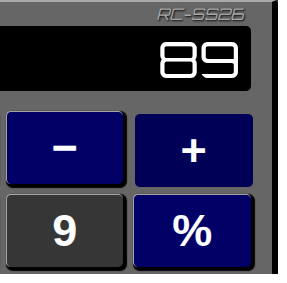

      
<h2>Realistic Calculator - Serkan Sarp, 2026</h2>

      
<b>EN: </b>A calculator project designed to work like a real calculator. Both the JavaScript code and the interface are built around this logic. It also supports keyboard input and visually activates the buttons' :active state when using the keyboard.

      

      
<b>TR: </b>Gerçek bir hesap makinesi mantığıyla çalışan bir hesap makinesi projesidir. JS kodu ve tasarımı bu mantığa uygun olarak oluşturulmuştur. Klavye üzerinden de giriş kabul eder ve klavye girdilerinde butonların :active durumunu görsel olarak aktif hale getirir.

